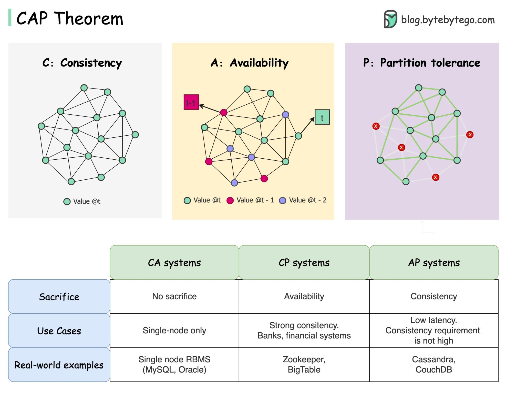

# CAP Theorem

CAP theorem states that a distributed system can only guarantee two of these
three properties at the same time.

- Consistency
- Availability
- Partition Tolerance

## What Is a Distributed System?

A distributed system is a system that runs across multiple nodes (servers)
instead of one.

```text
User → Node A
User → Node B
User → Node C
```

All three nodes store and serve data. The challenge is keeping them in sync.


## What Is a Network Partition?

A network partition happens when nodes cannot communicate with each other.

```text
Node A ←--✗--→ Node B
```

The connection breaks. Node A and Node B are now isolated.

This is not rare. In real distributed systems, network failures happen.


## C Is for Consistency

Consistency means every node returns the same data at the same time.

If you write a value to Node A, reading from Node B should return that same
value immediately.

```text
Write "price = $10" to Node A.
Read from Node B → must return $10, not an old value.
```

This is not the same as Consistency in ACID. In CAP, consistency means
"all nodes see the same data at the same time."

FOR CP --> "I don't know whether my data is up to date, so I won't respond."

## A Is for Availability

Availability means every request gets a response, even if some nodes are down.

```text
Node B crashes.
User sends a request.
Node A still responds. ✅
```

The response might not be the most up-to-date data, but the system does not
refuse the request.

For AP --> "I can't guarantee consistency, but I still return a response."

## P Is for Partition Tolerance

Partition tolerance means the system keeps running even when nodes cannot
communicate.

```text
Node A and Node B lose connection.
The system still operates. ✅
```

In a real distributed system, partition tolerance is not optional. Network
failures will happen. You must design for them.




## The Core Trade-Off

Because partition tolerance is required in practice, the real choice is between
consistency and availability when a partition occurs.

```text
Partition happens →

Option 1 (CP): Stop responding until nodes sync.
               Data is correct. System may be unavailable.

Option 2 (AP): Keep responding with possibly stale data.
               System stays up. Data may be inconsistent.
```


## Real-World Examples

## Real-World Example: E-Commerce Product Price

Imagine a product price is stored across three nodes.

An admin updates the price from $10 to $8. Node A receives the update.
Before Node B and Node C sync, a customer reads from Node B.

**CP system:**
```text
Node B is not synced yet.
System refuses to respond until sync is complete.
Customer waits or sees an error.
Data is always correct.
```

**AP system:**
```text
Node B is not synced yet.
System responds with the old price: $10.
Customer sees stale data temporarily.
System never goes down.
```


## Common Misconceptions

### Misconception 1: "Pick any two of three"

Partition tolerance is not optional in a distributed system. The real choice
is CP or AP when a partition occurs.

### Misconception 2: "CAP is enough to pick a database"

CAP is a starting point, not the whole story. Factors like query patterns,
latency, scalability, and ecosystem matter just as much.

### Misconception 3: "Consistency in CAP = Consistency in ACID"

They share the same word but mean different things.

| | Meaning |
|---|---|
| ACID Consistency | Data follows defined rules and constraints |
| CAP Consistency | All nodes return the same data at the same time |


## Simple Mental Model

```text
C: Every node agrees on the data.
A: Every request gets a response.
P: The system survives network failures.

In practice: P is required.
Real choice:  C or A when a partition happens.
```


## Practice Exercise

Imagine you are building a ride-sharing app.

The system must track driver locations across multiple servers in different
cities.

Answer these questions:

1. What could go wrong if consistency is prioritized over availability?

If a server in Istanbul loses connection to a server in Ankara,
the system stops responding to location requests until the connection
is restored. Drivers and passengers see errors instead of the map.
Passengers cannot find a driver. Drivers cannot receive ride requests.

2. What could go wrong if availability is prioritized over consistency?

A driver finishes a ride but the update has not synced across all nodes yet.
A passenger in a different region sees that driver as still available and
books them. The same driver gets assigned to two rides at the same time.

3. Which would you choose for driver location data, CP or AP? Why?

AP.

Driver location is time-sensitive but not critical to be exact.
A location that is 2 seconds old is still useful enough to show on a map.
Refusing to respond because nodes are out of sync is far worse than showing
a slightly stale position.

Availability matters more here than perfect consistency.
